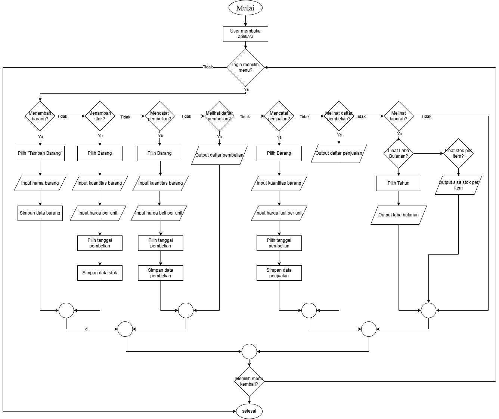

# TokoKita Web Application (Laravel)

[](https://laravel.com/)
[](https://www.php.net/)
[](https://getbootstrap.com/)
[](https://www.chartjs.org/)

Aplikasi web **TokoKita** adalah sistem manajemen inventaris dan penjualan yang lengkap, dibangun menggunakan Framework Laravel dengan PHP. Aplikasi ini menyediakan fitur untuk mencatat stok, pembelian, penjualan, serta menampilkan laporan laba bulanan dan sisa stok barang.

## Fitur Utama

1.  **Form Pembuatan Stok Baru**: Melakukan penambahan batch stok baru dengan kuantitas, harga beli per unit (untuk batch tersebut), dan tanggal penerimaan. 

2.  **Pencatatan Pembelian Stok**: Merekam transaksi pembelian barang, termasuk detail seperti nama barang, kuantitas, harga beli per unit (yang dapat bervariasi antar pembelian), dan tanggal pembelian. Setiap pembelian secara otomatis menambah batch stok baru.

3.  **Pencatatan Penjualan**: Merekam transaksi penjualan barang. Sistem ini secara otomatis mengurangi stok berdasarkan metode FIFO (First-In, First-Out). Terdapat validasi stok untuk menolak penjualan jika kuantitas yang diminta melebihi stok yang tersedia. HPP (Harga Pokok Penjualan) dihitung secara otomatis berdasarkan metode FIFO. 

4.  **Daftar Penjualan dan Pembelian**: Menampilkan riwayat lengkap semua transaksi penjualan dan pembelian yang telah dicatat. 

5.  **Laporan Laba Bulanan dan Sisa Stok**: Menyajikan laporan laba kotor bulanan (total penjualan dikurangi HPP) yang divisualisasikan dalam bentuk grafik sederhana. Juga menampilkan tabel sisa stok per item beserta estimasi nilainya. 

## Deliverables

Berikut adalah artefak yang disertakan dalam repositori ini sesuai dengan permintaan:

1.  **Dokumen Perencanaan**: 
    * Ringkasan requirement kelima fitur: Terangkum di bagian "Fitur Utama".
    * Model data & alasan pilihan storage: Dijelaskan di bagian "Pilihan Storage & Layanan Stub".
    * Pseudo-code/flowchart algoritma: Dijelaskan secara tekstual dalam bagian ini dan terimplementasi dalam `SaleController` serta divalidasi di `FifoLogicTest`.
2.  **Kode Implementasi**: Seluruh kode sumber, termasuk Controller, Model, Migrations, dan Views, tersedia di folder `app/`, `database/`, dan `resources/views/`.
3.  **Test Suite**: Tersedia di folder `tests/Unit/` dan `tests/Feature/`. Mencakup unit test untuk logika FIFO dan feature test untuk alur pembelian-penjualan.
4.  **README / Setup Guide**

## Instalasi dan Setup Aplikasi

Ikuti langkah-langkah di bawah ini untuk menjalankan aplikasi TokoKita di lingkungan lokal Anda. 

1.  **Kloning Repositori:**
    ```bash
    git clone <URL_REPOSITORI_ANDA>
    cd tokokita
    ```

2.  **Instal Dependensi Composer:**
    ```bash
    composer install
    ```

3.  **Konfigurasi Environment:**
    Buat salinan file `.env.example` dan ganti namanya menjadi `.env`.
    ```bash
    cp .env.example .env
    ```

4.  **Buat Kunci Aplikasi:**
    ```bash
    php artisan key:generate
    ```

5.  **Konfigurasi Database:**
    Buka file `.env` dan sesuaikan pengaturan database Anda. Aplikasi ini menggunakan database relasional (disarankan MySQL atau SQLite).
    Contoh konfigurasi untuk MySQL:
    ```dotenv
    DB_CONNECTION=mysql
    DB_HOST=127.0.0.1
    DB_PORT=3306
    DB_DATABASE=tokokita_db
    DB_USERNAME=root
    DB_PASSWORD=
    ```

6.  **Jalankan Migrasi Database:**
    Ini akan membuat tabel-tabel yang diperlukan di database Anda.
    ```bash
    php artisan migrate
    ```

7.  **Jalankan Aplikasi:**
    ```bash
    php artisan serve
    ```
    Aplikasi akan tersedia di `http://127.0.0.1:8000` (atau port lain yang ditampilkan).

## Menjalankan Test Suite

Proyek ini mencakup unit tests untuk logika FIFO dan integrasi tests untuk alur pembelian-penjualan. 

1.  **Konfigurasi Database Testing (Opsional tetapi disarankan):**
    Di file `.env`, tambahkan atau pastikan ada baris untuk database testing:
    ```dotenv
    DB_DATABASE=tokokita_test # Atau nama database khusus untuk testing Anda
    ```
    Pastikan database `tokokita_test` (atau nama yang Anda pilih) sudah dibuat di server database Anda.

2.  **Jalankan Migrasi untuk Database Testing:**
    ```bash
    php artisan migrate --env=testing
    ```

3.  **Jalankan Tes:**
    ```bash
    php artisan test
    ```

4.  **Melihat Laporan Cakupan Kode (Code Coverage):** 
    Untuk menghasilkan laporan cakupan kode (memerlukan ekstensi Xdebug PHP terinstal):
    ```bash
    php artisan test --coverage
    ```
    Laporan HTML akan dihasilkan di `storage/logs/coverage/html/index.html`. Target cakupan minimal adalah 80%. 

## Pilihan Storage & Layanan Stub 

**Pilihan Storage:**
Aplikasi ini menggunakan **database relasional (MySQL/SQLite)** yang dikelola oleh **Laravel Eloquent ORM**. Pilihan ini didasarkan pada beberapa alasan utama:

* **Sifat Data Relasional**: Data inventaris dan transaksi (barang, stok, pembelian, penjualan) memiliki hubungan yang kuat dan konsisten. Database relasional sangat efisien dalam mengelola hubungan ini dan memastikan integritas data.
* **ACID Compliance**: Untuk data keuangan dan inventaris, properti ACID (Atomicity, Consistency, Isolation, Durability) sangat penting untuk menjamin transaksi yang andal dan mencegah kehilangan data atau inkonsistensi.
* **Fitur ORM Laravel (Eloquent)**: Eloquent menyediakan antarmuka yang intuitif dan ekspresif untuk berinteraksi dengan database, yang mempercepat pengembangan dan menjaga kejelasan kode. Migrasi database bawaan Laravel juga memudahkan pengelolaan skema.
* **Implementasi FIFO**: Logika FIFO sangat cocok untuk diimplementasikan dengan query database yang mengurutkan berdasarkan tanggal dan ID, memungkinkan pengambilan batch stok yang benar secara efisien.

Meskipun dokumen menyebutkan "Firebase Firestore atau Database yang lain" untuk penyimpanan data di "klien", dalam konteks aplikasi Laravel (yang secara fundamental adalah aplikasi *server-side* yang melayani tampilan *frontend*), "klien" dalam konteks ini diinterpretasikan sebagai "sisi server aplikasi Laravel yang mengelola data". Firebase Firestore lebih umum digunakan pada arsitektur *frontend* SPA (Single Page Application) yang langsung berinterinteraksi dengan NoSQL database dari browser, yang merupakan pola arsitektur yang berbeda.

**Layanan Stub:**
Dalam implementasi ini, tidak ada "layanan stub" eksplisit yang digunakan. Aplikasi Laravel ini bertindak sebagai *full-stack*, di mana kontroler Laravel secara langsung berinterinteraksi dengan model Eloquent dan database. Ini adalah pola umum untuk aplikasi web berbasis Laravel. Jika ini adalah aplikasi *frontend* murni (misalnya, React atau Vue.js), maka "layanan stub" akan menjadi *mock API* atau *local JSON server* untuk menyimulasikan respons backend selama pengembangan *frontend* sebelum *backend* yang sebenarnya tersedia.

## Pseudo-code/Flowchart Algoritma Sistem

